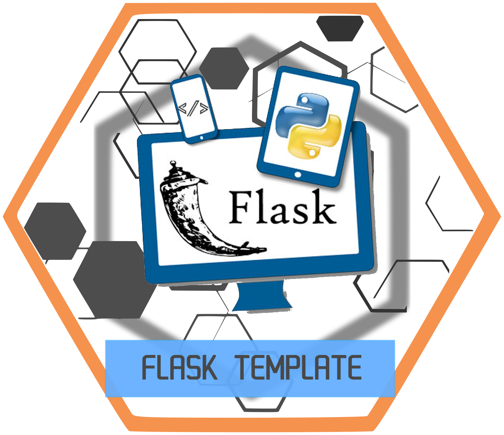

# HiveMind - Flask Chat Room



A multi-user Flask chatroom template for [HiveMind](https://github.com/OpenJarbas/HiveMind-core).

This simple WebUI allows you to securely interact with your OpenVoiceOS instance through [HiveMind](https://github.com/OpenJarbas/HiveMind-core).


This is a reference implementation for integrating the HiveMind server-side without requiring users to provide credentials.

For client-side (JavaScript) connection, check out [HiveMind-webchat](https://github.com/OpenJarbas/HiveMind-webchat).

## Installation

Install the package using `pip`:

```bash
$ pip install hivemind-flask-chatroom
```

## Running the Application

To run the chatroom, use the following command:

```bash
$ hivemind-flask-chatroom --port 8985
```

> Note: HiveMind credentials are read from your identity file.
