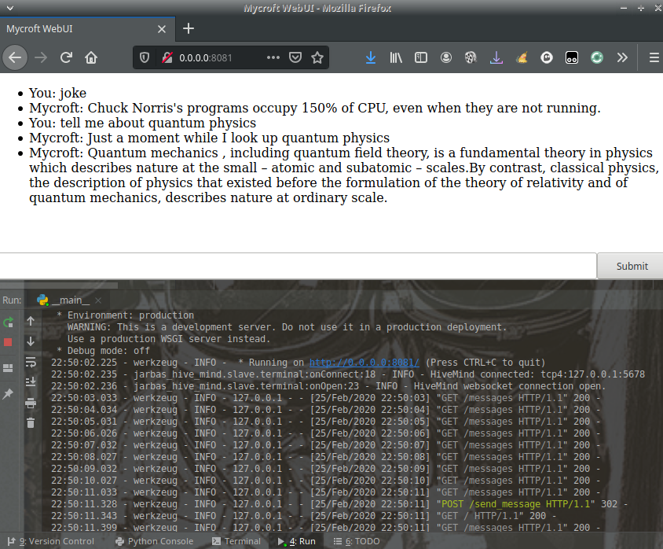

# HiveMind - Flask Terminal

A very simple WebUI for interacting with your Mycroft instance securely trough the [HiveMind](https://github.com/OpenJarbas/HiveMind-core)

Reference implementation on integration HiveMind with a flask app



## Usage

run ```/flask_terminal/__main__.py```

TODO: argparse, change ```/flask_terminal/__main__.py``` with your credentials


## Security

Running the flask app securely is out of scope for this repo, you will 
probably want to run it with SSL by using nginx or something similar

The connection to the HiveMind (mycroft) should also be secured in  [HiveMind-core](https://github.com/OpenJarbas/HiveMind-core)


## Credits

Forked from [TheLastProject/mycroft-WebUI](https://github.com/TheLastProject/mycroft-WebUI)