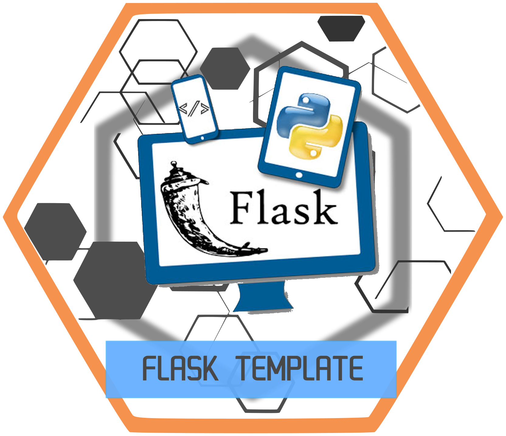
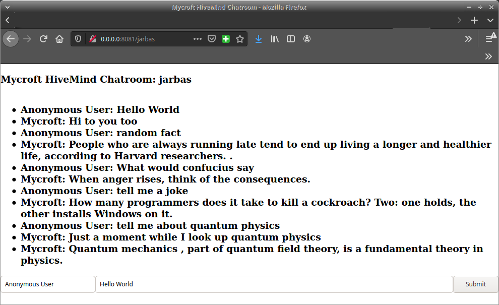

# HiveMind Flask Chatroom



A multi-user Flask chatroom that connects to a [HiveMind](https://github.com/JarbasHiveMind/HiveMind-core)
hub as a single satellite and fans it out to many browser users. Each visitor
chats under their own username and language; messages are routed to your
OpenVoiceOS assistant through the hub and spoken replies are streamed back into
the room.



## Where it sits

HiveMind is a mesh: satellites connect to a central
[hivemind-core](https://github.com/JarbasHiveMind/HiveMind-core) hub over an
authenticated, encrypted protocol. This app is **one** satellite — it holds a
single set of HiveMind credentials and authenticates server-side using the
Python [hivemind-bus-client](https://github.com/JarbasHiveMind/hivemind-websocket-client).
Browser users never see or supply credentials; they just pick a name and talk.

```
many browsers ──HTTP──► Flask app (1 HiveMind credential) ──encrypted──► hivemind-core ──► OVOS / agent
```

This is the counterpart to [HiveMind-webchat](https://github.com/JarbasHiveMind/HiveMind-webchat),
which connects **client-side** from each browser instead. Use this when you want
a shared room where the credential lives on the server.

## Install

```bash
pip install hivemind-flask-chatroom
```

Dependencies: `flask`, `hivemind-bus-client`.

## Quickstart

### 1. Run a hub and add this client

On the machine hosting the assistant, install and run
[hivemind-core](https://github.com/JarbasHiveMind/HiveMind-core):

```bash
hivemind-core add-client      # prints an access key + password
hivemind-core listen --port 5678
```

### 2. Provision the chatroom's identity

The chatroom authenticates from the HiveMind **identity file** rather than CLI
flags. Write the credentials from the previous step into it with the
`hivemind-bus-client` CLI:

```bash
hivemind-client set-identity \
  --key <access-key> \
  --password <password> \
  --host 127.0.0.1 --port 5678 \
  --siteid flask
```

This populates `~/.config/hivemind/_identity.json`, which the app reads on
startup. Verify it can reach the hub with `hivemind-client test-identity`.

### 3. Start the chatroom

```bash
hivemind-flask-chatroom --port 8985
```

Open `http://localhost:8985`. You are redirected to a room as `anon_user`; to
join under a specific name, language, or site, visit
`/chatroom/<username>/<site_id>/<lang>` directly (for example
`/chatroom/alice/livingroom/en`). Type a message and the assistant's reply
appears prefixed with your username.

## Command-line options

```
usage: hivemind-flask-chatroom [-h] [--port PORT] [--host HOST]
                               [--log-level LOG_LEVEL] [--log-path LOG_PATH]

options:
  -h, --help            show this help message and exit
  --port PORT           Chatroom port (default 8985)
  --host HOST           Bind address (default 0.0.0.0)
  --log-level LOG_LEVEL DEBUG / INFO / ERROR (default DEBUG)
  --log-path LOG_PATH   Log directory; default <xdg_state>/hivemind,
                        or "stdout" to log to the console
```

## How it works

- On startup `MessageHandler.connect()` opens one `HiveMessageBusClient`
  (useragent `JarbasFlaskChatRoomV0.2`, `site_id="flask"`) to the hub and
  subscribes to `speak`, `ovos.common_play.play`, and the legacy audio-play
  message.
- Each browser user maps to an OVOS `Session` keyed by username, so per-user
  `lang` and `site_id` preferences persist across turns. Outgoing utterances
  carry that session so skills can tell users apart.
- Routes: `GET /` redirects into a room; `GET /chatroom/<username>/<site_id>/<lang>`
  renders the room; `POST /send_message` submits an utterance; `GET /messages`
  returns the running message log as JSON (the page polls it).

The HiveMind link is end-to-end encrypted between the Flask process and the hub;
the browser-to-Flask hop is plain HTTP, so front it with a TLS reverse proxy
(nginx, Caddy) for any non-local deployment.

## See also

- [docs/usage.md](./docs/usage.md) — identity provisioning, multi-user routing,
  and the message API in more detail.
- [HiveMind-webchat](https://github.com/JarbasHiveMind/HiveMind-webchat) — the
  browser-side single-user equivalent.

## License

Apache 2.0 — see [LICENSE](./LICENSE).
