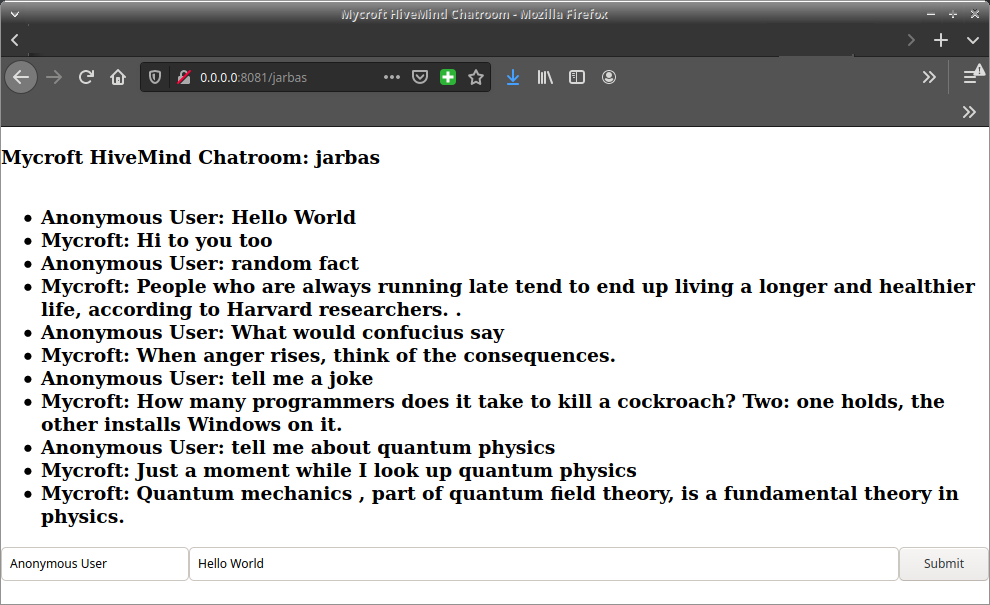

# HiveMind - Mycroft Chat Room

Flask Room for [Mycroft HiveMind](https://github.com/JarbasSkills/skill-hivemind)

A very simple WebUI for interacting with your Mycroft instance securely trough the [HiveMind](https://github.com/OpenJarbas/HiveMind-core)

Reference implementation on integration HiveMind with a flask app



## Install

```bash
$ pip install HiveMind-chatroom
```
## Usage

```bash
$ HiveMind-chatroom --help
usage: HiveMind-chatroom [-h] [--access_key ACCESS_KEY] [--crypto_key CRYPTO_KEY] [--name NAME] [--host HOST] [--port PORT] [--flask-port FLASK_PORT] [--flask-host FLASK_HOST]

optional arguments:
  -h, --help            show this help message and exit
  --access_key ACCESS_KEY
                        access key
  --crypto_key CRYPTO_KEY
                        payload encryption key
  --name NAME           human readable device name
  --host HOST           HiveMind host
  --port PORT           HiveMind port number
  --flask-port FLASK_PORT
                        Chatroom port number
  --flask-host FLASK_HOST
                        Chatroom host

```

Default values are

```
--access_key - "RESISTENCEisFUTILE"
--crypto_key - "resistanceISfutile"
--name - "JarbasChatRoomTerminal"
--host - "wss://127.0.0.1"
--port - 5678
--flask-port - 8081

```